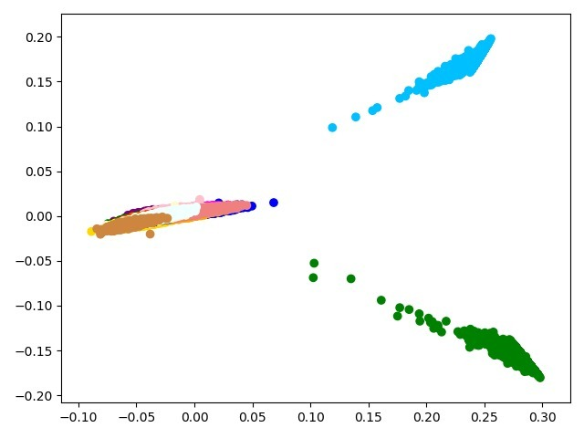

##### The Project
The following project demonstrates how an unexcepted approach to a project can achieve outstandingly accurate results. Many NLP projects that deal with text often tend to use bag-of-words models (TF-IDF, etc.), but for the mission of detecting a language based on textual input, a different, more abstract approach can be taken. The idea is to look at character (or letter) frequencies within a sentence, instead of looking at the words within the text. This works because each language has its own set of used letters, and moreover – has a unique frequency pattern for each character within a sentence. For example, a sentence written in French has a considerable amount of "e", and will probably include the characters "ç" or "â", while a sentence written in English or Dutch will most likely not have them. This is, of course, a trivial example, but it gets trickier when trying to tell apart languages like Danish from Swedish or Estonian from Finnish, that look very similar in their written form. The frequency of each character within a sentence is the key for overcoming this challenge.

##### The Data
The European parliament's proceedings, which are available for free download in most of the union's official languages, here: http://www.statmt.org/europarl/ 

##### The Method
We parse each text file (proceeding in a specific language) into sentences and take a sample of 10,000 sentences that are at least 200 characters long (in order to decrease the variance of the frequency vectors, more on that later). We then create a corpus of all the letter characters that appear in the selected sentences, from all the languages in our data. Then, we once again go through the sentences' list and for each sentence create a frequency histogram (or frequency vector) that records the percentage of each character from the corpus in each sentence, thus representing each sentence as a 204 entries vector (204 for the 204 characters in the corpus) that together form a convex set. Now that each sentence is represented as a point in space, we can use a KNN model to classify new unlabeled sentences that we introduce to the classifier. 
I chose K=10 as it delivered a ~99% accuracy rate on the test set – it may seem like an overfit, but numerous testing attempts using text from across the web proved the model's success. However, these results are mostly achieved by feeding a medium size sentence up to a paragraph size pieces of text, as a single word or a short sentence may not be represented subtly and accurately enough by this method (a disadvantage of not maintaining a word corpus).

Bonus for the end: a plot that represents languages in space (using PCA to reduce the dimension from 204 to 2):

>Each sentence is a point in space and each color represents a different language. On the left: languages that use the Latin alphabet. The blue blob at the upper right: Greek, and Below lies Bulgarian, in green. The latter two use a non-Latin alphabet (Greek and Cyrillic, respectively).

The project was adapted from: https://data-science-blog.com/blog/2018/11/12/language-detecting-with-sklearn-by-determining-letter-frequencies/

#### Thanks for reading!
